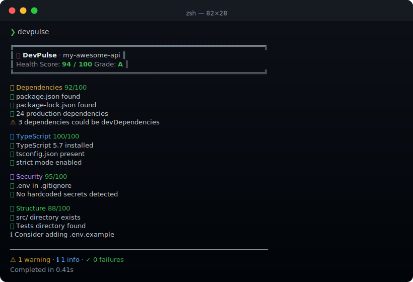

<div align="center">

# 💓 devpulse

**Know your project's health before your users do.**

Score your codebase in seconds — dependencies, TypeScript config, security, git hygiene, and project structure, all in one shot.

[](https://nodejs.org)
[](https://www.typescriptlang.org)
[](LICENSE)
[](https://www.npmjs.com/package/devpulse)



</div>

---

## Why devpulse?

Every project accumulates technical debt quietly — an outdated dep here, a missing `.gitignore` entry there, a forgotten `strict: false` in tsconfig. By the time you notice, it's a production incident.

`devpulse` gives you a **health score and grade** in under a second, so you catch problems before they catch you.

```bash
npx devpulse
```

That's it. No config, no setup, no account. Just run it in your project root.

---

## Features

- **Health Score** — A weighted 0–100 score with an A–F grade, so you always know where you stand
- **6 Check Categories** — Dependencies · TypeScript · Security · Git · Scripts · Structure
- **Secret Scanner** — Detects hardcoded API keys, tokens, and credentials before they leak
- **Actionable Output** — Every warning tells you exactly what to fix and why it matters
- **Zero Config** — Reads your existing `package.json`, `tsconfig.json`, `.gitignore` — no setup needed
- **CI Friendly** — `--json` flag outputs machine-readable results; exits `1` on failures for pipeline gates
- **Focused Modes** — Run only the checks you care about with subcommands

---

## Quick Install

```bash
# Run instantly with npx (no install needed)
npx devpulse

# Or install globally
npm install -g devpulse
```

---

## Usage

```bash
# Full project health check (default)
devpulse

# Dependency analysis only
devpulse deps

# Security audit only
devpulse security

# Check a different directory
devpulse --path ./my-other-project

# Machine-readable JSON output (great for CI)
devpulse --json
```

### Example Output

```
╔══════════════════════════════════════════════════════╗
║  💓 DevPulse  ·  my-awesome-api                      ║
║  Health Score: 94 / 100   Grade: A                   ║
╚══════════════════════════════════════════════════════╝

📦 Dependencies                                  92/100
  ✅  package.json found
  ✅  package-lock.json found
  ✅  24 production dependencies
  ⚠️   3 deps could be devDependencies

🔷 TypeScript                                   100/100
  ✅  TypeScript 5.7 installed
  ✅  tsconfig.json present
  ✅  strict mode enabled

🔒 Security                                      95/100
  ✅  .env is in .gitignore
  ✅  No hardcoded secrets detected

📁 Structure                                     88/100
  ✅  src/ directory found
  ✅  Tests directory found
  ℹ️   Consider adding .env.example

──────────────────────────────────────────────────────
  ⚠  1 warning  ·  ℹ  1 info  ·  ✓  0 failures
  Completed in 0.41s
```

---

## What It Checks

| Category | Checks |
|---|---|
| **Dependencies** | package.json · lock file · dep count · duplicates · flagged packages |
| **TypeScript** | version · tsconfig · strict mode · @types/node |
| **Security** | .env gitignore · hardcoded secrets · dangerous scripts |
| **Git** | .git dir · .gitignore coverage · uncommitted changes · README |
| **Scripts** | build · test · lint · dev · typecheck |
| **Structure** | src/ · test dirs · .env.example · untracked secrets |

---

## CI Integration

Use `devpulse` as a quality gate in your pipeline:

```yaml
# .github/workflows/quality.yml
- name: Project health check
  run: npx devpulse --json | tee health.json
  # Exits with code 1 if any failures are found
```

---

## Tech Stack

| Technology | Version | Purpose |
|---|---|---|
| Node.js | 20+ | Runtime |
| TypeScript | 5.7 | Strict type safety |
| Commander | 12 | CLI argument parsing |
| Chalk | 5 | Terminal colors |
| Boxen | 8 | Bordered output boxes |
| Ora | 8 | Progress spinners |
| semver | 7 | Version comparison |

---

## License

MIT © [Mario Tavarez](https://github.com/mariotavarez)
